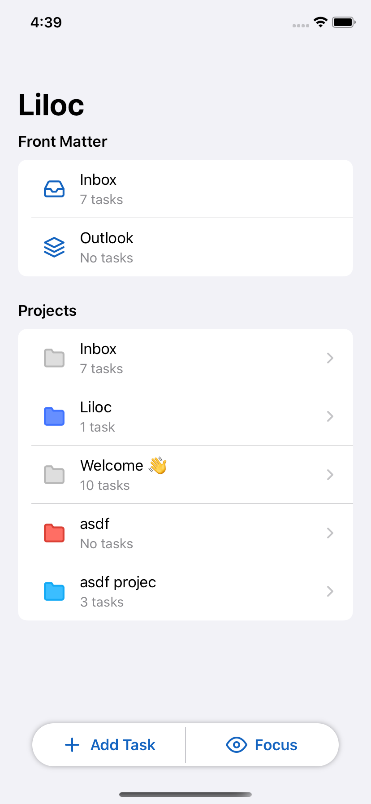
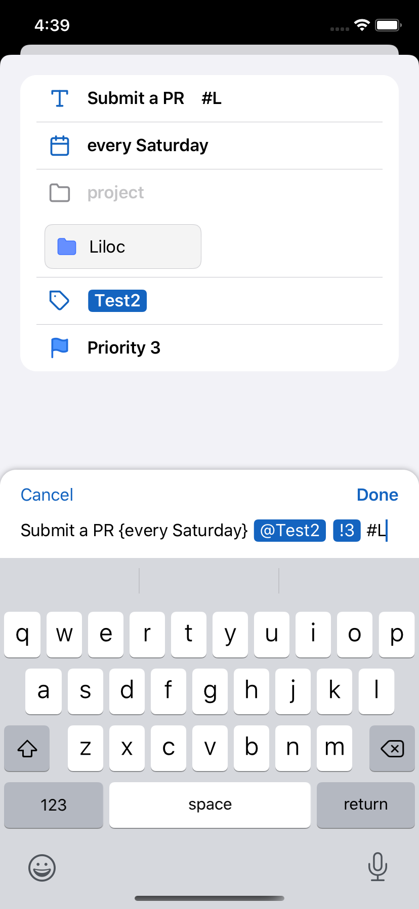

# Liloc

### Tasks + Time Tracking

Liloc's goal is to combine the best of two services: Todoist and Toggl. 

### Getting Started

Liloc uses Carthage to manage its dependencies. To get started with Liloc:

1. Clone the repository
2. [Install Carthage](https://github.com/Carthage/Carthage#installing-carthage)
3. `$ carthage update --platform iOS` - This pulls dependencies and builds them. It'll probably take a while.
4. Open `Liloc.xcodeproj`
